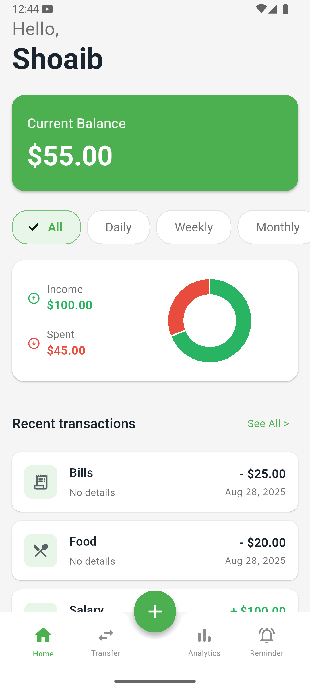
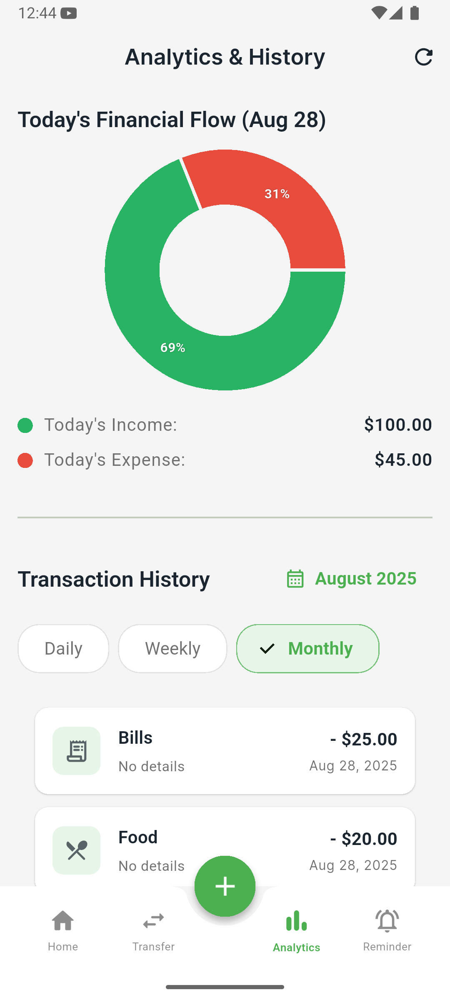
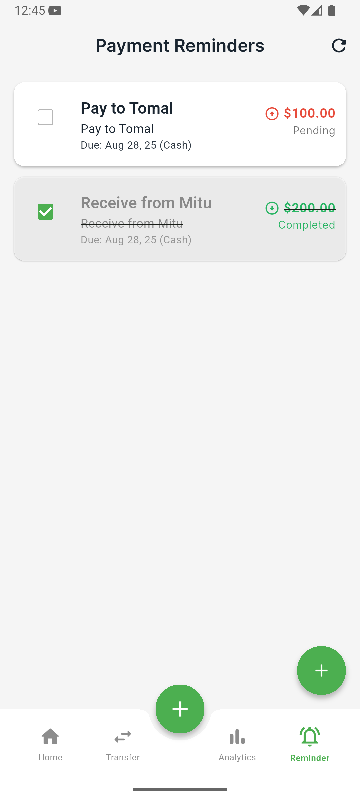

# Finance Tracker

A Flutter application for tracking personal finances, managing transactions, and setting payment reminders.

## Features

- **Transaction Management:**
  - Add, edit, and delete income and expense transactions.
  - Categorize transactions (e.g., Food, Bills, Salary).
  - View transactions by day, week, month, or all time.
- **Data Visualization:**
  - Pie chart to visualize today's income vs. expenses.
  - Donut chart to visualize filtered income vs. expenses.
- **Financial Overview:**
  - Dashboard with current balance, and summary of income and expenses.
- **Reminders:**
  - Set reminders for payments to be given or received.
  - Mark reminders as complete.
- **Local Storage:**
  - Uses an SQLite database to store all data locally on the device.

## Screenshots

| Home Page | Analytics | Reminder |
| :---: | :---: | :---: |
|  |  |  |

## Getting Started

To get a local copy up and running follow these simple steps.

### Prerequisites

- Flutter SDK: [https://flutter.dev/docs/get-started/install](https://flutter.dev/docs/get-started/install)

### Installation

1. Clone the repo
   ```sh
   git clone https://github.com/your_username/finance_tracker.git
   ```
2. Install packages
   ```sh
   flutter pub get
   ```
3. Run the app
   ```sh
   flutter run
   ```

## Dependencies

- `flutter`
- `sqflite`
- `path_provider`
- `intl`
- `fl_chart`
- `flutter_slidable`
- `google_fonts`
- `animations`

## Dev Dependencies

- `flutter_test`
- `flutter_lints`
- `flutter_launcher_icons`

## Contributing

Contributions are what make the open source community such an amazing place to learn, inspire, and create. Any contributions you make are **greatly appreciated**.

1. Fork the Project
2. Create your Feature Branch (`git checkout -b feature/AmazingFeature`)
3. Commit your Changes (`git commit -m 'Add some AmazingFeature'`)
4. Push to the Branch (`git push origin feature/AmazingFeature`)
5. Open a Pull Request

